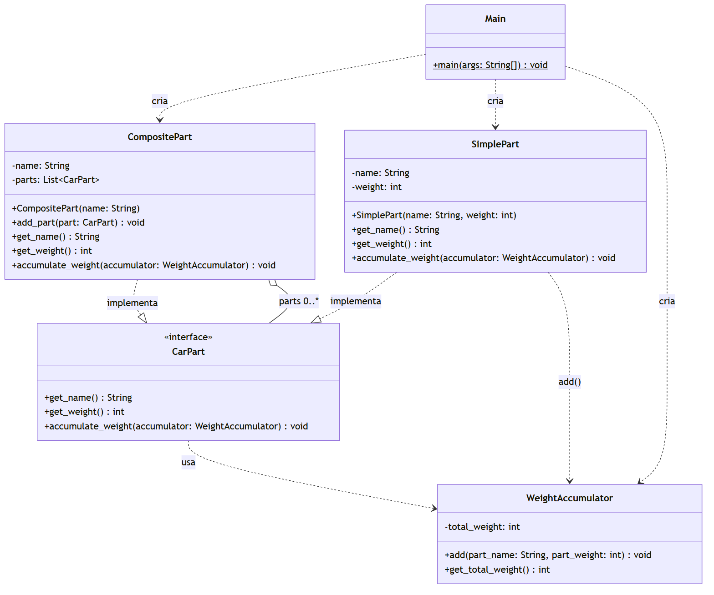

# Peso do carro com o padrão Composite

Questão da disciplina de Padrões de Projeto (IFPE) resolvida com o padrão **Composite**.

## O problema

Um carro é formado por peças. Algumas são simples (motor, porta, roda...) e têm um peso
próprio; outras são agrupamentos de peças (a carroceria, o chassi, o trem de força), e o
peso delas é a soma do peso de tudo que está dentro. Um grupo pode conter outros grupos,
então o carro vira uma árvore.

O objetivo é calcular o peso total do carro tratando peça simples e grupo de peças da
mesma forma, sem o código cliente precisar saber se está lidando com uma folha ou com um
nó que tem filhos.

## Papel de cada classe no Composite

| Classe | Papel no padrão | O que faz |
| --- | --- | --- |
| `CarPart` | **Component** (interface) | Contrato comum a todas as peças: `get_name()`, `get_weight()` e `accumulate_weight(WeightAccumulator)`. |
| `SimplePart` | **Leaf** (folha) | Peça que não tem filhos. Guarda nome e peso; `get_weight()` devolve o próprio peso e `accumulate_weight()` entrega nome e peso ao acumulador. |
| `CompositePart` | **Composite** (composto) | Guarda uma `List<CarPart>` e adiciona filhos com `add_part(CarPart)`. `get_weight()` soma o peso dos filhos e `accumulate_weight()` repassa o acumulador para cada um deles, recursivamente. |
| `WeightAccumulator` | Auxiliar | Percorre as folhas somando o peso: `add(part_name, part_weight)` soma e imprime o total parcial; `get_total_weight()` devolve o total. |
| `Main` | **Client** | Monta a árvore do carro, dispara a acumulação e imprime o peso total. |

## Diagrama de classes



O fonte do diagrama está em [`docs/diagrama-classes.mmd`](docs/diagrama-classes.mmd)
(Mermaid). Relações:

- `SimplePart` e `CompositePart` **implementam** `CarPart`;
- `CompositePart` **agrega** `0..*` `CarPart` (a lista `parts`), que podem ser folhas ou
  outros compostos;
- `CarPart`/`SimplePart` **dependem** de `WeightAccumulator`;
- `Main` **depende** das classes concretas, porque é quem cria os objetos.

## A árvore montada no `Main`

```
Carro (372)
├── Carroceria (125)
│   ├── Para-lama dianteiro esquerdo (10)
│   ├── Para-lama dianteiro direito (10)
│   ├── Para-lama traseiro esquerdo (10)
│   ├── Para-lama traseiro direito (10)
│   ├── Porta dianteira esquerda (15)
│   ├── Porta dianteira direita (15)
│   ├── Porta traseira esquerda (15)
│   ├── Porta traseira direita (15)
│   ├── Painel (5)
│   ├── Porta-malas (8)
│   └── Capo (12)
└── Chassi (247)
    ├── Trem de forca (227)
    │   ├── Motor (90)
    │   ├── Transmissao (40)
    │   ├── Diferencial (25)
    │   ├── Roda dianteira esquerda (18)
    │   ├── Roda dianteira direita (18)
    │   ├── Roda traseira esquerda (18)
    │   └── Roda traseira direita (18)
    └── Suspensao (20)
```

`Carro`, `Carroceria`, `Chassi` e `Trem de forca` são `CompositePart`; o resto são
`SimplePart`. O peso entre parênteses dos compostos é a soma dos filhos.

## Como rodar

Precisa de um JDK instalado. Na raiz do projeto:

```bash
javac -d bin *.java
java -cp bin Main
```

## Saída do programa

```
Somando agora o peso de Para-lama dianteiro esquerdo: 10. Total parcial: 10
Somando agora o peso de Para-lama dianteiro direito: 10. Total parcial: 20
Somando agora o peso de Para-lama traseiro esquerdo: 10. Total parcial: 30
Somando agora o peso de Para-lama traseiro direito: 10. Total parcial: 40
Somando agora o peso de Porta dianteira esquerda: 15. Total parcial: 55
Somando agora o peso de Porta dianteira direita: 15. Total parcial: 70
Somando agora o peso de Porta traseira esquerda: 15. Total parcial: 85
Somando agora o peso de Porta traseira direita: 15. Total parcial: 100
Somando agora o peso de Painel: 5. Total parcial: 105
Somando agora o peso de Porta-malas: 8. Total parcial: 113
Somando agora o peso de Capo: 12. Total parcial: 125
Somando agora o peso de Motor: 90. Total parcial: 215
Somando agora o peso de Transmissao: 40. Total parcial: 255
Somando agora o peso de Diferencial: 25. Total parcial: 280
Somando agora o peso de Roda dianteira esquerda: 18. Total parcial: 298
Somando agora o peso de Roda dianteira direita: 18. Total parcial: 316
Somando agora o peso de Roda traseira esquerda: 18. Total parcial: 334
Somando agora o peso de Roda traseira direita: 18. Total parcial: 352
Somando agora o peso de Suspensao: 20. Total parcial: 372
Peso total do carro: 372
```

As linhas "Somando agora..." vêm do `WeightAccumulator` percorrendo as folhas em
profundidade; a última linha vem de `car.get_weight()`, que calcula o mesmo total
somando recursivamente pelos compostos.
